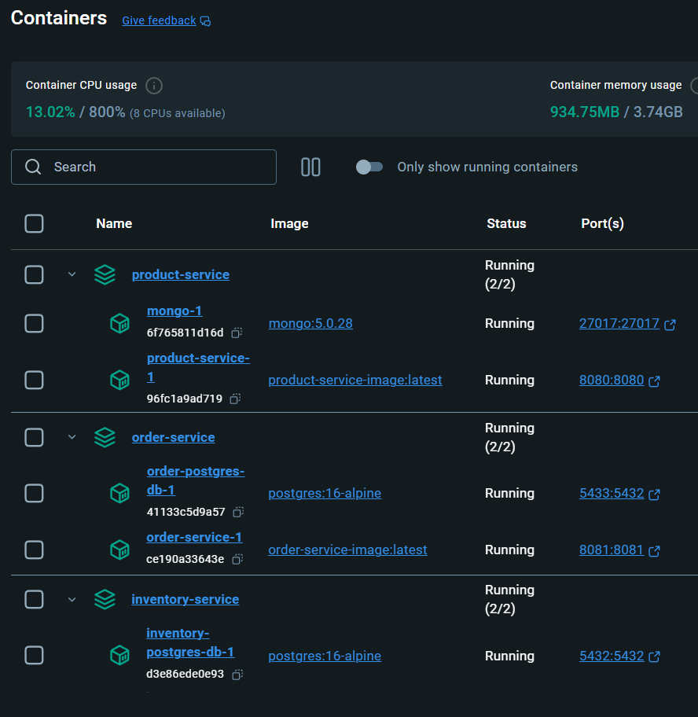

# Spring Boot 3 Microservices Project

Monorepo E-commerce project for learning purposes. In progress.

List of services:
 - Product service
 - Inventory Service
 - Order Service

Current Stack:
Spring Boot 3, Java 17, Gradle, MongoDB, PostgreSql, REST API, TestContainers, Flyway, Docker, Spring Cloud OpenFeign

Common library versions placed to one place at [libs.versions.toml](gradle%2Flibs.versions.toml)

## Start Microservices

To start all Microservices in Docker, please run:
```shell
./start_services.sh
```

To stop all Microservices, please use:
```shell
./stop_services.sh
```



# OpenAPI Documentation

Product service (MongoDB)
- http://localhost:8080/swagger-ui/index.html#/
- http://localhost:8080/v3/api-docs

Order Service (PostgreSQL)
- http://localhost:8081/swagger-ui/index.html#/
- http://localhost:8081/v3/api-docs

Inventory Service (PostgreSQL)
- http://localhost:8082/swagger-ui/index.html#/
- http://localhost:8082/v3/api-docs

Postman
[Microservices - OpenAPI.postman_collection.json](Microservices%20-%20OpenAPI.postman_collection.json)

# Useful PostgreSQL Commands
**Login**
```sql
psql -U product_user -d product_db
```
```sql
psql -U order_user -d order_db
```
```sql
psql -U inventory_user -d inventory_db
```

**Tables Info**
```sql
\dt;
```
```sql
SELECT table_name FROM information_schema.tables;
```

**Select - reserved keyword table**
```sql
select * from "order";
select * from order_line_items;
select * from order_order_line_items;
select * from inventory;
select * from flyway_schema_history;
```


## Test
```shell
./gradlew test
```
Or
```shell
./gradlew :product-service:test
```

```shell
./gradlew :order-service:test
```

```shell
./gradlew :inventory-service:test
```

## Run
```shell
./gradlew bootRun
```
Or
```shell
./gradlew :product-service:bootRun
```

```shell
./gradlew :order-service:bootRun
```

```shell
./gradlew :inventory-service:bootRun
```

## Database services

Inventory PostgreSQL
```shell
docker compose -f inventory-service/docker-compose.yml up -d inventory-postgres-db
```

Order PostgreSQL
```shell
docker compose -f order-service/docker-compose.yml up -d order-postgres-db
```

Product MongoDB
```shell
docker compose -f product-service/docker-compose.yml up -d mongo
```

Flyway scripts check
```
jar tf build/libs/inventory-service-0.0.1-SNAPSHOT.jar | grep migration
```
```
docker exec -it 7c9a6cff9ef2 ls db/migration
```

Todo:
- Fix network issues
- Implement Notification Service with Kafka Event
- Port to Kubernetes